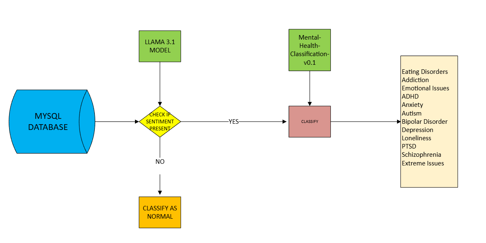
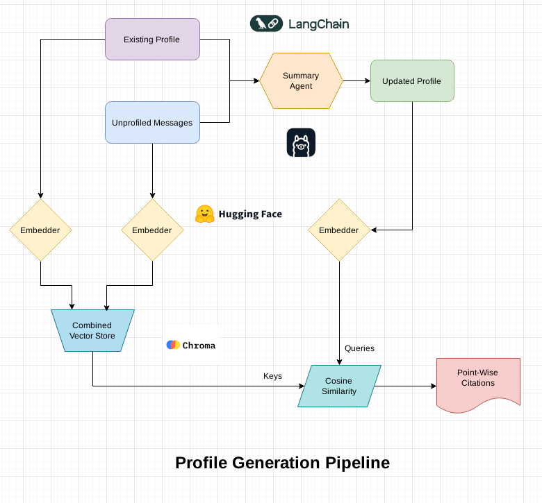

# 🌿 **Persona**  
An interactive AI-powered mental wellness platform built by **Team Draco 🐉** for the **"PersonaBot: AI-Driven User Profiling"** problem statement at **ICTC 3.0**.  

## 🔧 Setup

- Run `pip install -r requirements.txt`
- Setup the MySQL database `Outputs/Databases/database.sql`
- Setup the MySQL credentials in `web_app/user_site/.streamlit/secrets.toml` and `backend/.streamlit/secrets.toml`
- Setup Ollama and run:
   - `ollama pull llama3.1`
   - `ollama pull llama3.2`
   - `ollama pull hf.co/victunes/TherapyBeagle-11B-v2-GGUF:Q2_K`

## 🚀 **Key Features**  

✅ **Empathetic & Inquisitive Therapy Experience**  
The AI model, with **10.7 billion parameters**, has been fine-tuned on **99,000+ mental health conversations** to provide a supportive and insightful user experience.  

✅ **Engaging & Friendly Conversations**  
PersonaBot asks thoughtful, **inquisitive questions** in a natural and friendly manner, encouraging users to open up about their concerns.  

✅ **Voice & Human Support Options**  
Users can access **voice-over support** and connect with professional counselors for additional guidance.  

✅ **User-Centric Design**  
The platform's **UI is designed with real feedback** from **IIT Patna students**, ensuring a seamless and user-friendly experience tailored to their needs.  

   

### **Model Used** 
https://huggingface.co/victunes/TherapyBeagle-11B-v2-GGUF

## 💡 **Smart Inferencing System for Detecting Potential Disorders**  

### ⚙️ **How It Works**  
✅ The inferencing system **analyzes each user message** to detect potential mental health issues.  
✅ Utilizes a **bi-agent system** to enhance prediction accuracy.  
✅ The platform can **classify each message** into one of the following categories:  
   - **Normal**  
   - **Eating Disorders**  
   - **Addiction**  
   - **Emotional Issues**  
   - **ADHD**  
   - **Anxiety**  
   - **Autism**  
   - **Bipolar Disorder**  
   - **Depression**  
   - **Loneliness**  
   - **PTSD**  
   - **Schizophrenia**  
   - **Extreme Issues**  

✅ This system **runs in the background** and provides **valuable insights for counselors** to better understand user concerns.  

### **Sample Output of the Inferencing Program**  
  

### **Models Used**  
- [Mental Health Classification Model v0.1](https://huggingface.co/tahaenesaslanturk/mental-health-classification-v0.1)  
- **LLaMA 3.1**  

## 🎯 Profile Generation Pipeline

We implement a precise yet efficient user profiling system for the therapeutic chatbot, utilizing a unique citation generation mechanism.

### 🚀 Key Features:
✅ Retrieves unprofiled user messages from the MySQL database

✅ Updates existing user profiles with information from unprocessed messages using a summarization agent (LLM)

✅ Implements a unique citation generation mechanism that employs semantic similarity scores to propagate citations across profile updates over time

### 💡 Citation Generation Mechanism:
1. Summarizer Agent:

   ✅ Employs a ChatOllama model to summarize user messages while augmenting them with the existing profile
   
   ✅ Generates concise, non-repetitive summaries of all user information till-date
   

3. Cosine Similarity (using ChromaDB):

   ✅ Uses HuggingFace embeddings (sentence-transformers/all-mpnet-base-v2) for semantic similarity scoring
   
   ✅ Stores embeddings from both the persistent profile, and the unprofiled messages in in-memory ChromaDB collections for efficient querying
   
   ✅ Propagates chat message citations by finding the most similar messages to each profile point
   

### ⭐ Usage

✅ Automatically updates user profiles based on new, unprofiled messages

✅ Marks profiled messages in the database to prevent redundant updates

✅ Can be run as a standalone script to update profiles for all users

## 🤝 **Counsellor Dashboard**  

### 🌟 **Key Features**  
💻 **Interactive Dashboard:**  
Provides mental wellness experts with a **comprehensive view** of the student community’s overall well-being.  

🔧 **User Profiles with Citations:**  
Each user has a **detailed profile** along with **relevant citations** to help counselors better understand individual cases.  

🤖 **Automated Summaries:**  
Generates **concise summaries** for each user, assisting counselors in the **diagnostic process**.  

📊 **Psychological Trends & Graphs:**  
Displays **real-time visualizations** of the individual’s **mental health trends**, allowing experts to track psychological patterns.

### **Dashboard Preview** 

  

## 📈 Results
### Message Inferencer Accuracy

**Accuracy of classification =  69.35%**

**Accuracy of finding whether disorder is present or not = 98.387%**

