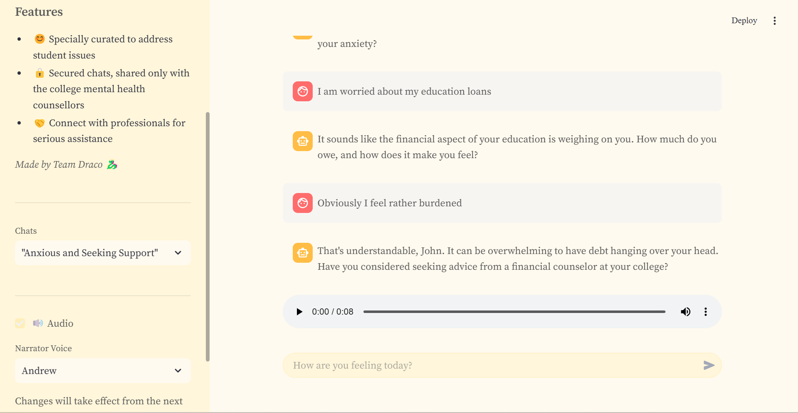

# 🌿 **Persona**

An interactive, AI-powered mental wellness platform built by **Team Draco 🐉** for the **_PersonaBot: AI-Driven User Profiling_** problem statement at **ICTC 3.0**

## 🔧 Setup

- Run `uv sync` to fetch the Python dependencies
- Setup the MySQL database `outputs/database.sql`
- Setup your MySQL credentials in `.streamlit/secrets.toml`
- Setup Ollama and run:
   - `ollama pull llama3.1`
   - `ollama pull llama3.2`
   - `ollama pull hf.co/victunes/TherapyBeagle-11B-v2-GGUF:Q2_K`

## 📖 Usage

### 🌐 Web Apps

- `python web_app/user_site/main.py`
- `python web_app/counsellor_site/main.py`

### 🗄️ Backend Scripts

- `python backend/profiler.py`
- `python backend/inferencer.py`

## 🚀 **Key Features**

✅ **Empathetic & Inquisitive Therapy Experience**
The AI model, with **11B parameters**, has been fine-tuned on **~100,000 mental health conversations** to provide a supportive and insightful user experience.

✅ **Engaging & Friendly Conversations**
PersonaBot asks thoughtful, **inquisitive questions** in a natural and friendly manner, encouraging users to open up about their concerns.

✅ **Voice & Human Support Options**
Users can access **voice-over support** and connect with professional counselors for additional guidance.

✅ **User-Centric Design**
The platform's **UI is designed with real feedback** from **IIT Patna students**, ensuring a seamless and user-friendly experience tailored to their needs.

## 👥 Profile Generation Pipeline

We implement a precise yet efficient user profiling system for the therapeutic chatbot, utilizing a unique citation generation mechanism.

### 🚀 Key Features:

✅ Automatically fetches unprofiled user messages from the chat database

✅ Updates existing user profiles with information from unprocessed messages using a summarization agent (LLM)

✅ Marks profiled messages in the database to prevent redundant updates

✅ Implements a unique citation generation mechanism that employs semantic similarity scores to propagate citations across profile updates over time

✅ Can be run as a standalone script to update profiles for select (or all) users

### 💡 Two-Phase Workflow:

1. Summarizer Agent:

   - Employs a ChatOllama model to summarize user messages while augmenting them with the existing profile

   - Generates concise, non-repetitive summaries of all user information till-date

2. Citations Using Semantic Similarity:

   - Uses HuggingFace embeddings for semantic similarity scoring

   - Stores embeddings from the persistent profile, and the newly-profiled messages into a combined in-memory ChromaDB collection for efficient querying

   - Propagates chat message citations by finding the most similar messages to each profile point

## 💡 **Smart Inferencing System for Detecting Potential Disorders**

The inferencing system efficiently performs a preliminary mental diagnosis of the user messages

### ⚙️ **How It Works**

✅ Analyzes **each user message** to detect potential mental health issues

✅ Utilizes a **bi-agent system** to enhance prediction accuracy

✅ Can classify each message into one of **13 categories** including:

   - **Loneliness**
   - **Anxiety**
   - **Depression**
   - **Potential Self Harm**

✅  **Runs in the background** and provides **valuable insights for counselors** to better understand user concerns

### › **Sample Output of the Inferencing Program**

### 📈 Evaluations

- Accuracy of classification: **69.4%**
- Accuracy of finding whether a disorder is present: **98.4%**

## 🤝 **Counsellor Dashboard**

### 🌟 **Key Features**

💻 **Interactive Dashboard:**
Provides mental wellness experts with a **comprehensive view** of the student community’s overall well-being

🔧 **User Profiles with Citations:**
Each user has a **detailed profile** along with **relevant citations** to help counselors better understand individual cases

🤖 **Automated Summaries:**
Generates **concise summaries** for each user, assisting counselors in the **diagnostic process**

📊 **Psychological Trends & Graphs:**
Displays **real-time visualizations** of the individual’s **mental health trends**, allowing experts to track psychological patterns

